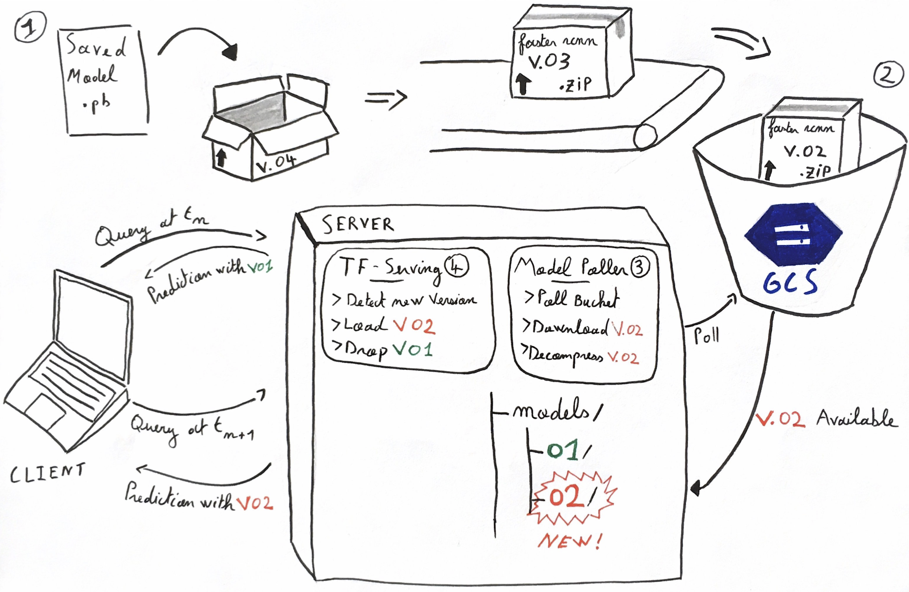

# A `model_poller` sidecar container to feed  `tensorflow/serving` with up to date model versions

## What's in the box?
This repository illustrates the [sidecar container design pattern](https://docs.microsoft.com/en-us/azure/architecture/patterns/sidecar) applied to [tensorflow serving](https://www.tensorflow.org/serving/) to automatically pull new model versions from a storage bucket.

## Gist 
The goal of this pattern is to use a vanilla tensorflow-serving container coupled with a sidecar container polling a storage for new versions of a models.

When a new version of the model is pushed in  the storage, it is downloaded, decompressed and moved to the directory used by tensorflow serving to load models. 
Then, tensorflow serving automatically load the new version, serves it and gracefully terminate the serving of the previous version.



1. After training, a model is exported as  [`saved_model`](https://www.tensorflow.org/guide/saved_model) that can be used for inference.  
2. The folder containing the `saved_model` and its assosciated variables is named with a version number _e.g._ `0001`. The folder `0001` is compressed in a `zip` and uploaded in a storage bucket.
```bash
# Structure of the versionned model folder

 0001/
  |
  |--saved_model.pb 
  |
  |--variables/
  |     |
  |     ...
```

3. In the server, two containers: `tensorflow/serving` and `model_poller` are running and share the same local file system. `model_poller` polls the bucket for new versions and download the new versions available for a given model. The new version of the model is downloaded in the folder used by tensorflow serving to check for model sources.

4. `tensorlfow/serving` detects that a new version of the model in available. It automatically loads it in memory. It starts serving incoming requests with the new version while finishing to process the requests on the previous version. Once all the requests on the former version have been handled it is unloaded from memory. The version upgrade has been without service interruption.
 

## Setting-up the `model_poller` to listen to a Google Cloud Storage bucket changes

A Docker Image built from this respository `Dockerfile` can be obtained on Docker hub. You can quickly test the pattern with this image and a tensorflow serving model.

0. Setup a Google cloud project, check the steps detailed in [docs/gcloud_setup.md](docs/gcloud_setup.md).
From now on, I assume you have a valid GCP project, created a storage bucket with a subscription and have a `json` service key. The IAM process is done with a Google Application Credentials `json` key passed to the container at runtime. 

1. The simplest way to reproduce the results is to pull the `model_poller` image.
```bash
docker pull popszer/model_poller:v0.1.6
```

2. Run the `model_poller`
```bash
# Update the environment variables and the `model_poller` image version accordingly

# Declare environment variables
PROJECT_ID=tensorflow-serving-229609
SUBSCRIPTION=model_subscription
SAVE_DIR=/shared_dir/models
GOOGLE_APPLICATION_CREDENTIALS="/shared_dir/tf-key.json"

# Run model poller
docker run --name model_poller -t \
-v "/Users/fpaupier/Desktop/tst_poller:/shared_dir" \
-e PROJECT_ID=$PROJECT_ID \
-e SUBSCRIPTION=$SUBSCRIPTION \
-e SAVE_DIR=$SAVE_DIR \
-e GOOGLE_APPLICATION_CREDENTIALS=$GOOGLE_APPLICATION_CREDENTIALS \
popszer/model_poller:v.0.1.6 &
``` 

While the container is running, upload some files in the 
bucket (you could use the console or gsutil) and watch as changes scroll by
in the `$SAVE_DIR`.

## Setting up tensorflow serving

The `model_poller` is a sidecar container to be used with [`tensorflow_serving`](https://www.tensorflow.org/serving/). The steps below are inspired from the official doc and gives perspective on how to use the two containers simultaneously.

1. Download the TensorFlow Serving Docker image and repo
```bash
docker pull tensorflow/serving
```
2. Select a model to serve. For testing, you can find plenty of object detection models available on the [model zoo](https://github.com/tensorflow/models/blob/master/research/object_detection/g3doc/detection_model_zoo.md).
I take [`faster_rcnn_inception_v2_coco`](http://download.tensorflow.org/models/object_detection/faster_rcnn_inception_v2_coco_2018_01_28.tar.gz) as an example. _The use case here is the following_:
You launch a first version `0001` of this model in production. After a while, you fine tune some hyper parameters and train it again. Now you want to serve the version `0002`.
On your server you have a tensorflow/serving docker image running:

```bash
# TensorFlow Serving container and open the REST API port
docker run -t --rm -p 8501:8501 \
   -v "/home/fpaupier/tf_models/saved_model_faster_rcnn:/models/faster_rcnn" \
   -e MODEL_NAME=faster_rcnn \
   tensorflow/serving &
```

**The `model_poller` sidecar shall download new versions of the model in the directory used by `tensorflow/serving` as the models' source** , e.g. the `/home/fpaupier/tf_models/saved_model_faster_rcnn` folder here. Then, the models with the highest version number will be automatically served/ (_i.e. if the folder contains a folder `000x` and one `000y` with `y > x`, the version `y` will be served).

Time to test, upload the compressed model in the bucket listened by the `model_poller` and `tensorflow/serving` will start to serve it.

There is no downtime for the switch of model version.

------------

## Manual setup
You may want to modify the `model_poller` to fit it to your use case (different IAM process, change of cloud provider, ...). The steps below gives you guidelines to reproduce a working environment.

### Install steps
For testing and playing around you can use the local setup steps.
1. Create a virtualenv
```bash
`which python3` -m venv model_polling
```

2. Activate the virtualenv 
```bash
source /path/to/model_polling/bin/activate
```

3. Install the requirements
```bash
pip install -r requirements.txt
```

4. This example project uses GCP as cloud services provider.
Make sure to [authentificate your project](https://cloud.google.com/docs/authentication/getting-started).
Create a service key, download it and set the environment variable accordingly:
```bash
export GOOGLE_APPLICATION_CREDENTIALS="/home/user/Downloads/[FILE_NAME].json"
```

5. Run the model poller app
```bash
python model_polling.py  $PROJECT_ID $SUBSCRIPTION $SAVE_DIR
```

6. Finally, build the docker image:
```bash
# Where vx.y.z follow the semantic versionning --> https://semver.org/
docker build \
-t model_poller:vx.y.z \
--rm \
--no-cache .
```

You can now push your image to an image repository and use it combined with tensorflow-serving to continuously deploy new model versions in production with no downtime.

## Next steps
This project is a proof of concept, thus it can be enhanced in many ways.

- [ ] Delete local model files when model are removed from the bucket.
- [ ] Investigate different IAM process 
- [ ] Propose a sample k8s.yaml configuration file that would be use to deploy the `model_poller` and `tensorflow/serving` containers at the same time.